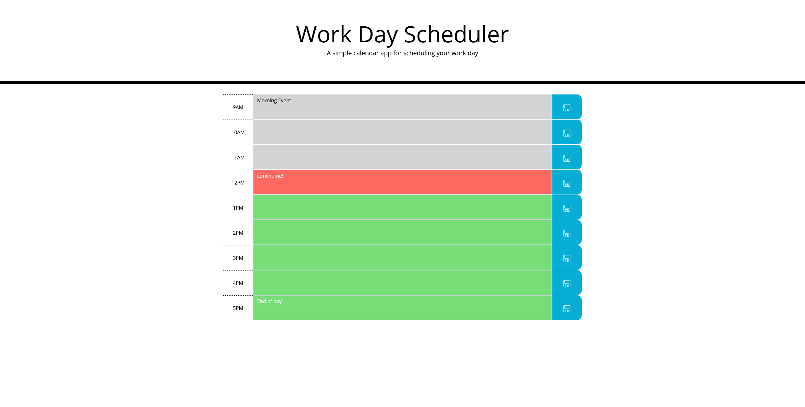

# WorkdayScheduler

Simple scheduling app to store events in timeslots. 

Uses localstorage to keep track of events and prefill timeslots on page load.

Dynamically styles time slots based on current time of day.

[Live site](https://alexandergalen.github.io/WorkdayScheduler/)

